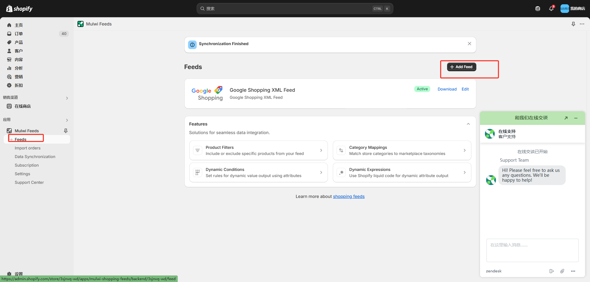
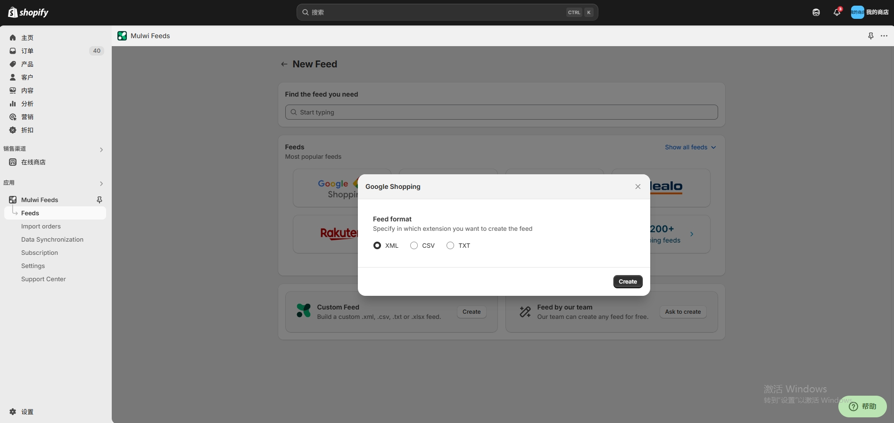
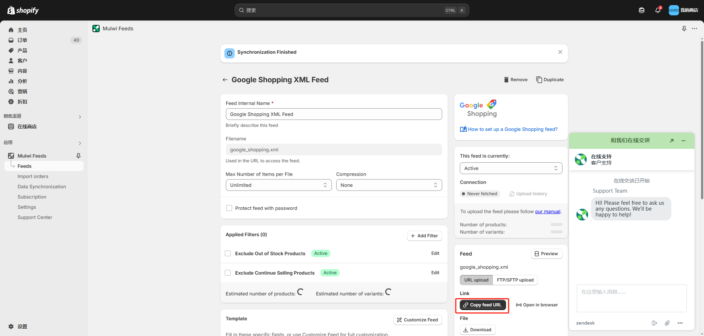

# How to create Google Shopping xml in Shopify?

**Step 1: Search "Mulwi Feeds" app and install.**

**Step 2: Go to "Mulwi Feeds" and Click "+ Add Feed**

**Step 3: Choose "Google Shopping" and "XML".**

**Step 4: Enter "Feed Internal Name" and "Filename".Click "Save" and click "Copy feed URL"**

