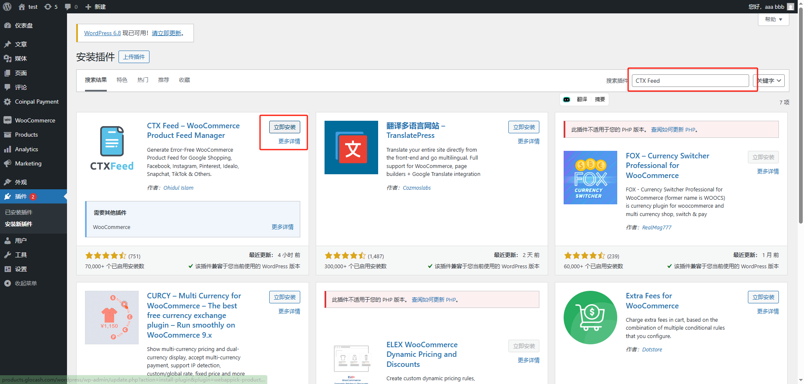
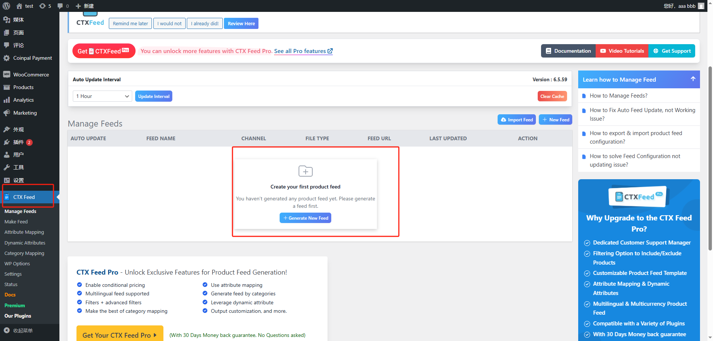

# How to create Google Shopping xml in WordPress?

**Step 1: In the left-side menu, find "Plugins" and click on it. Search "CTX Feed" Plugin and install.**

**Step 2: In the left-side menu, find "CTX Feed" and click on it. Create your first product feed or click "+ New Feed"**

**Step 3: Related options should be selected according to the following image.**

**Step 4: Copy "FEED URL".**

